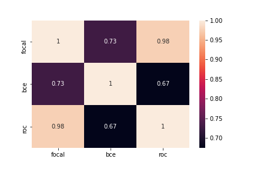

# General Overview

This repository contains code for the IEEE Fraud Detection competition on Kaggle. The goal of the competition is to predict whether a transaction is fraudulent or not based on various features. The code uses denoising autoencoders for feature engineering and trains a simple neural network with 5-fold stratified cross-validation using focal loss, Wilcoxon Mann Whitney U statistic, and binary cross-entropy with stochastic weight averaging and snapshot ensembling. The final predictions are obtained by taking the mean of the predictions of three models.

## Preprocessing and Feature Engineering

### Continuous Features

For continuous features with skew greater than 1, the code subtracts the minimum value and takes the log of the column. It then applies standard scaling to the data.

### Categorical Features

For each categorical column, the code uses one-hot encoding for the 50 most frequent values and replaces the rest with 'Other'.

## Magic Feature

The code creates a magic feature by analyzing the V307 column. It calculates the cumulative transaction amount for each individual and then groups by certain columns to get the cumulative transaction amount for each group. By subtracting the last value of V307 from the cumulative transaction amount, the code aims to get a value close to 0. This process helps identify columns that can be used to identify individuals.

## Model Training

The repository contains several models, each with different configurations and loss functions.

### Simple Model with UID Embeddings

This model is a simple neural network with three dense layers, followed by batch normalization and dropout of 0.3. It concatenates the magic feature (ID) after embedding it to 4 dimensions and predicts using a dense layer with 1 neuron and sigmoid activation. The model is trained with binary cross-entropy and k-fold cross-validation.

### Simple Model with ROC AUC and UID Embeddings

This model is the same as the previous one but trained using Wilcoxon-Mann-Whitney U statistic as the loss function.

### Simple Model with Focal Loss and UID Embeddings

This model is the same as the previous one but trained using focal loss as the loss function.

### Simple Model with UID Embeddings and SWA

This model is the same as the simple model with UID embeddings but uses stochastic ensembling and snapsort at a cycle length of 4 for 16 epochs.

### Simple Model with ROC AUC and UID Embeddings with SWA

This model is the same as the simple model with ROC AUC and UID embeddings but uses stochastic ensembling and snapsort at a cycle length of 4 for 16 epochs.

### Simple Model with Focal Loss and UID Embeddings with SWA

This model is the same as the simple model with focal loss and UID embeddings but uses stochastic ensembling and snapsort at a cycle length of 5 for 20 epochs.

## Results

The table below shows the performance metrics for different models on the public and private test sets:

| Loss Function                    | AUC (Public) | AUC (Private) |
|----------------------------------|--------------|---------------|
| ROC Approximation                | 0.944        | 0.909         |
| Focal Loss                       | 0.948        | 0.916         |
| Binary Crossentropy              | 0.934        | 0.902         |
| ROC Approximation with SWA       | 0.951        | 0.916         |
| Focal Loss with SWA              | 0.949        | 0.917         |
| Binary Crossentropy with SWA     | 0.950        | 0.920         |

## Ensemble Results

The ensemble of the best models achieved an AUC of 0.952 on the public test set and 0.921 on the private test set.

## Correlation among Predictions

The heatmap below shows the correlation among the predictions of the best models:

## References

- Kaggle Discussion: [Link](https://www.kaggle.com/c/ieee-fraud-detection/discussion/111476)
- Research Paper on Autoencoders: [Link](https://arxiv.org/abs/1704.00109)
- Research Paper on Focal Loss: [Link](https://arxiv.org/abs/1803.05407)
- Kaggle Discussion on Stochastic Weight Averaging and SnapShot Ensembling: [Link](https://www.kaggle.com/c/data-science-bowl-2019/discussion/127210)
